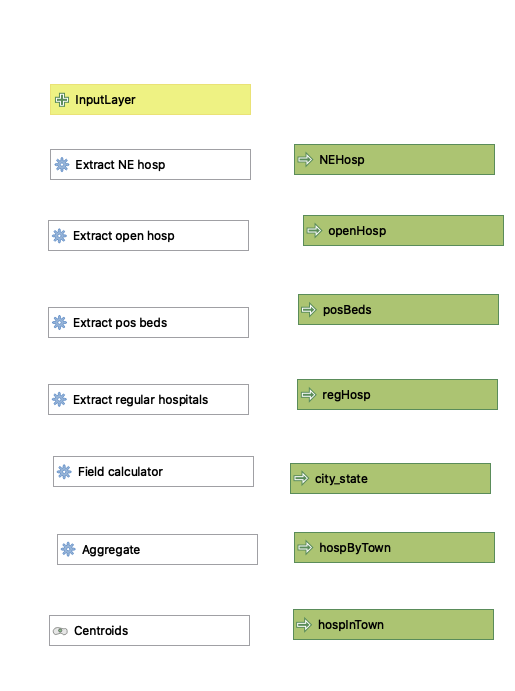
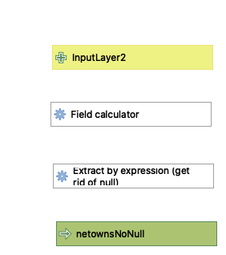
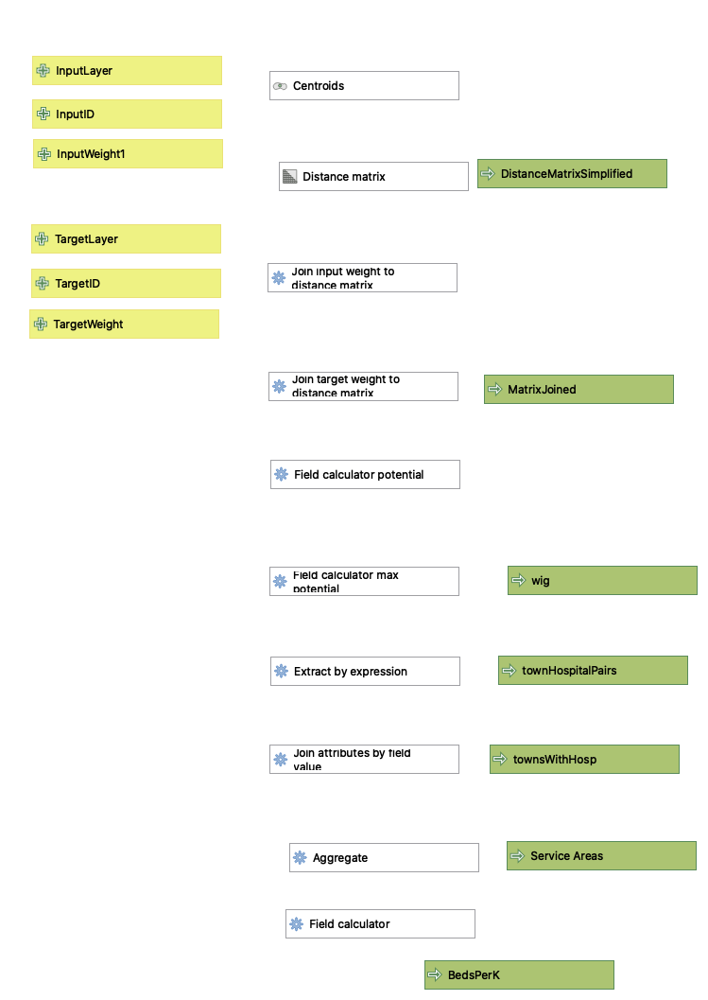

[Leaflet map of hospital service areas in the Northeast](negravweb/index.html)

This project, working on the "Gravity Model" empowered us to use hospital data provided by the Department of Homeland Security and US Census data to create a model which generates service areas for hospitals in a given region. These service areas are based off of a number of factors, taking into account population of a town, number of beds in a hospital - or agglomeration of hospitals, in this case, and distance froma town to a number of hospitals.

[Hospital pre-processing workflow](hosp_pre_process.model3)

First, the data given by the DHS needed to be processed in order to extract just general hospitals in the region. The workflow below enabled us to do so, using extract by expression and aggregate functions to, over a series of steps, filter out hospitals outside of the given region; include just hospitals classified as general acute care, critical access, women's or children's; eliminate hospitals that were closed or had no data available on number of beds available; and to aggregate hospitals within the same county subdivision or city. This enabled us to better understand how many beds were available per 100,000 residents, as patients do not necessarily all flock to the largest hospital in a given city that they may be "zoned" for.

[Town pre-processing workflow](town_pre_process.model3)

Next, after encountering some issues with towns resulting in null geometries which were unable to be used by the final gravity model, it was discovered that it would be necessary to process the given town data to eliminate these, not unlike the process undertaken for the hospitals. This was a much simpler process, simply finding those towns without valid geometries and then extracting only the ones with valid geometries.

[Gravity model workflow](updatedGravModel.model3)

Due to the expanded nature of this project as compared to earlier similar assignments, some slight changes needed to be made to the gravity model. A major part of this was due to the presence of town names repeating throughout the Northeast. To avoid aggregating, for example, New London, CT and New London, NH and their hospitals, it was necessary to a) create an additional field with both city and state information in the town pre-processing, as well as slightly change some components of the join fields in some of the operations of the gravity model workflow. Otherwise, only minimal changes were undertaken, and the results of the pre-processes were able to be fairly readily plugged in to the existing gravity model workflow that we had previously created.

I was surprised by the amount of variation between the Dartmouth Hospital Service Areas and those calculated by the model created here. To some extent, slightly more "scraggly" boundaries for the Dartmouth HSAs could be explained by the use of zipcodes in defining them, as opposed to town boundaries, but other discrepancies did exist. One such variance was the seemingly larger catchment areas possessed by smaller hospitals compared to their larger counterparts, e.g. Manchester Memorial Hospital vs. those located in Hartford and Middlebury's own Porter Hospital vs. UVM Medical Center. The exponent which helped to determine the weight given to distance remained "2" throughout the two models, so I would have to imagine that Dartmouth may have given more weight to distance, favoring smaller-but-closer hospitals over larger-but-further hospitals.
